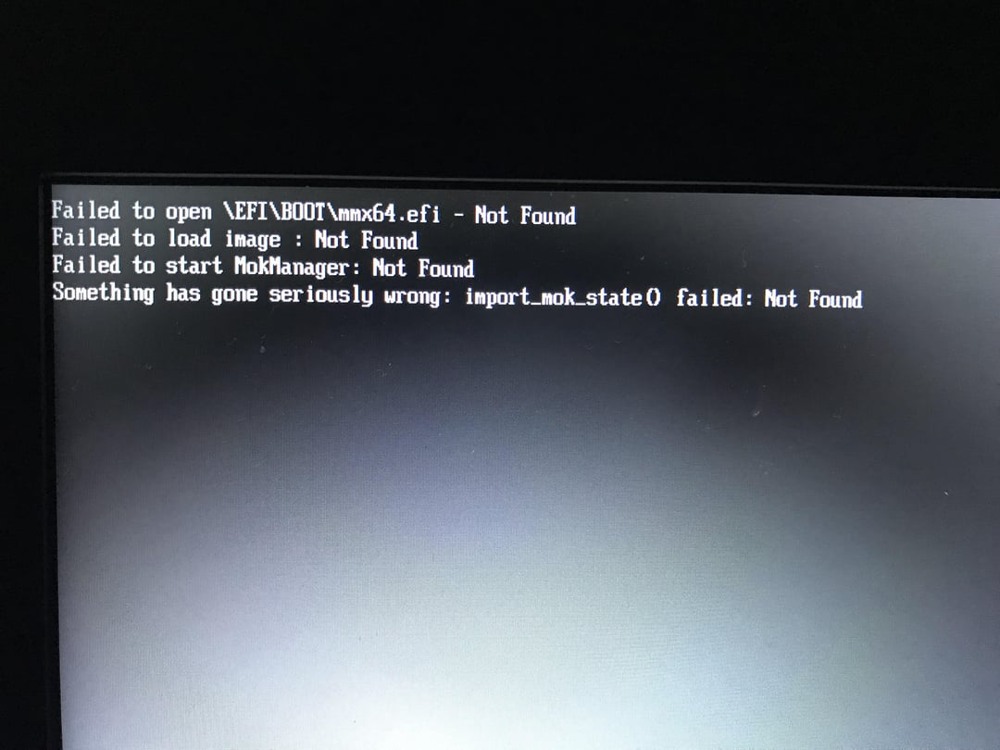

---
authors:
  - "@nicknamenamenick"

tags:
  - Installation
---

<!-- ANCHOR: METADATA -->
<!--{"url_discourse": "https://universal-blue.discourse.group/docs?topic=2495", "fetched_at": "2024-09-03 16:43:22.238775+00:00"}-->
<!-- ANCHOR_END: METADATA -->

## Error Code 1

The "code 1" error is a generic error code that appears during installation when a more specific error message isn't available. This error can occur in several scenarios that we have identified so far but there may be more scenarios:

- **Existing Fedora Installation:** If you've previously installed Nobara, Bazzite, or any Fedora-based OS on your drive, the installer might fail when writing the EFI entries because a "Fedora" folder already exists there.
  - **Fix 1:** The video below explains one way to resolve this.   https://www.youtube.com/watch?v=GRdz08hJByo   In summary, you'll need to access the terminal, identify and mount the EFI system partition, remove the existing "Fedora" folder. 
  - **Fix2:** You can use manual partitioning as described in the [Dual Boot Setup Guide](./dual_boot_setup_guide.md#manual-partitioning-to-the-same-drive-for-dual-boot-setups) to create a new EFI partition. 
  - **Fix3:** If you are not dual-booting, follow the [Installing Bazzite for Desktop/Laptop Hardware guide](./Installing_Bazzite_for_Desktop_or_Laptop_Hardware.md) as removing everything on the drive will remove the EFI partition fixing the error
- **Incorrect Filesystem:** Using the EXT4 or any other filesystem type for the root partition will cause this error. You must use BTRFS for the root partition.
- **Corrupted ISO Image:** Ensure the ISO image isn't corrupted by calculating the checksums or using the official torrent when downloading Bazzite.
- **Overheating USB Flash Drive:** Use a USB 3.0 or better flash drive and plug it into a USB 3.0 or better port to avoid overheating.

## "Device is Active" Error

**Watch this video for a workaround**:

https://www.youtube.com/watch?v=FBGLLkIKp-w

## "Error checking storage configuration"

**Watch this video for a workaround**:

https://www.youtube.com/watch?v=VTnm9EiBdPA

## "Bad shim signature, you need to load the kernel first" error

**Watch this video for a workaround**:

https://www.youtube.com/watch?v=Z_DsWqTuipU

## "Failed to open \EFI\BOOT\mmx64.efi - Not Found" error

To work around this issue, boot from file. Go into your UEFI (BIOS), select your EFI partition with Bazzite installed, then select /EFI/fedora/grubx64.efi to boot from.
After this, your boot manager should boot normally showing "FEDORA" as the option.

>[**Secure Boot Guide**](/General/Installation_Guide/secure_boot.md)

## Unable to allocate requested partition scheme error

This error occurs when installing on drives larger than 2TB where the first 2TB or more is already occupied by one or more partitions. The image below illustrates the error message.

It seems like the Anaconda installer cannot create any paritions after the 2TB mark.

Here are some possible solutions on how you can address it:

- Install Bazzite on a different storage device where Bazzite can have the entire drive.
- If you're dual booting with Windows, reduce the size of your Windows partition to under 2TB. If Windows' Disk Management can't do this, consider using a third-party tool like [EaseUS Partition Master](https://www.easeus.com/partition-master/) to resize the partitions while Windows is not running.
- If the drive contains no important data, you can delete all existing partitions and restart the installation process.

## Alternative Installation Method

!!! note

    **The alternative installation method is useful for downloading a smaller ISO and may resolve issues with downloading Bazzite's ISO, but contains installer display issues on most handheld hardware**.

If none of the above errors are relevant to your issue, or you still have problems installing Bazzite, then try following our alternative installation method:

[**Try installing Bazzite by rebasing from Fedora Kinoite (KDE Plasma) or Fedora Silverblue (GNOME)**](/General/Installation_Guide/alternate-install-guide.md).
